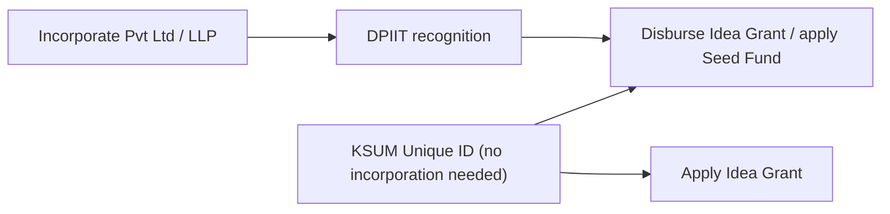

# 03 — DPIIT (Startup India) + KSUM Unique ID Registration Guide

These are real-world portal actions, marked **[ACTION]**. Everything you can
prepare in advance is filled in below so each form is a copy-paste exercise.

## Sequence at a glance

Key timing fact: for the **Idea Grant**, KSUM Unique ID is needed only *before
disbursal*, and incorporation + DPIIT only *before disbursal* too. So you can
apply on the strength of the idea/MVP now and complete the formalities once
shortlisted. Do the KSUM Unique ID first (free, fast, no company needed).

## Part A — KSUM Unique ID  [ACTION]

1. Go to the Kerala Startup Mission portal: <https://startupmission.kerala.gov.in/>
   and create a founder account / register your startup profile.
2. Complete the startup profile (use the prepared answers below).
3. On approval you receive the **KSUM Unique ID** (the reference KSUM schemes ask
   for). No company incorporation is required at this stage.

### Prepared profile inputs (copy-paste)

- Startup / product name: **FarmTwin**
- Sector: **Agritech / Deeptech (Simulation & AI)**
- Stage: **Prototype / MVP**
- One-line description: *Simulation-driven farm digital twin that optimizes
  irrigation, fertigation and yield for rain-shadow farmers and FPOs.*
- Location/District: **Palakkad** (Eruthempathy, Chittur)
- Founder: 20 years CAE / simulation experience (meshing, virtual assembly-line
  simulation) — see `02-problem-statement.md` skill map.

## Part B — DPIIT (Startup India) recognition  [ACTION]

Prerequisite: a registered entity (Pvt Ltd / LLP / OPC). Do this right after
incorporation (see `06-incorporation-guide.md`).

1. Create an account at **<https://www.startupindia.gov.in/>**.
2. Go to *Recognition -> Apply for DPIIT Recognition*; this redirects to the
   National Single Window System (NSWS) where the DPIIT form now lives.
3. Fill the recognition form (prepared answers below) and upload documents.
4. On approval you get the **DPIIT Recognition Number / Certificate**.

### DPIIT eligibility self-check (you pass)

- Entity age < 10 years from incorporation. **Pass** (new company).
- Annual turnover < Rs.100 cr in any year since incorporation. **Pass.**
- Not formed by splitting/reconstructing an existing business. **Pass.**
- Working towards innovation/improvement of products/processes/services with
  scalability + employment/wealth-creation potential. **Pass** (deeptech sim).

### Documents to keep ready

- Certificate of Incorporation / LLP registration.
- PAN of the entity.
- Brief write-up on what is innovative + scalable — use this paragraph:

> FarmTwin is a physics-and-agronomy simulation engine that represents a farm
> as a computational mesh of zones and time-steps a water-balance and
> crop-growth solver to recommend per-zone, per-day irrigation and fertigation.
> Unlike sensor dashboards, it predicts outcomes and optimizes schedules under a
> constrained water budget, enabling 30-50% water savings at protected yield.
> It is scalable as SaaS across farms, FPOs and government extension programs.

- (Optional, strengthens case) MVP link/screenshots from `../mvp/index.html`,
  any pilot data, awards, or IP filings.

## Part C — Link DPIIT to KSUM and schemes  [ACTION]

Once you hold both the KSUM Unique ID and DPIIT recognition, attach the DPIIT
number to your KSUM profile so you become eligible for Seed Fund / Scale-up
(Idea/Productisation grants need DPIIT only at later milestone stages — confirm
current requirement on the scheme page at apply time).

## Checklist

- [ ] KSUM Unique ID issued
- [ ] Entity incorporated (doc 06)
- [ ] DPIIT recognition number issued
- [ ] DPIIT number linked in KSUM profile
- [ ] MVP link + one-pager attached to profile
