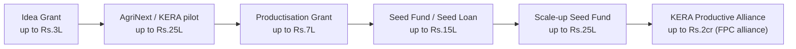

# 07 — Funding Roadmap (Grant -> Seed -> Scale-up)

Sequence non-dilutive money first, prove traction on the farm + one FPO, then
take debt/equity only when it accelerates a working model.

## Stage-gated plan

| Stage | Target money | Pre-conditions | Trigger to apply |
| --- | --- | --- | --- |
| 1. Idea Grant | up to Rs.3L | KSUM Unique ID (before disbursal) | MVP ready (done) + pilot plan |
| 2. AgriNext/KERA | up to Rs.25L | Startup registered on KERA portal | Problem statement + FPO match (doc 05) |
| 3. Productisation Grant | up to Rs.7L (Rs.4L if Idea Grant taken) | Pvt Ltd/LLP + active MCA + KSUM ID | MVP -> product, early traction |
| 4. Seed Fund / Seed Loan | up to Rs.15L (soft loan, ~6%) | Pvt Ltd/LLP in Kerala, DPIIT, CIBIL>750 | Purchase orders / committed FPO pilots |
| 5. Scale-up Seed Fund | up to Rs.25L | **Pvt Ltd**, DPIIT, Rs.25L revenue or investment, Rs.5L last quarter | Repeatable paid FPO deployments |
| 6. KERA Productive Alliance | up to Rs.2cr (60% matching) | Alliance with an eligible FPC | Cluster-scale rollout |

Note on stacking: Idea + Productisation are tranches of the same Innovation Grant
ceiling (total ~Rs.15L, Rs.20L women). Plan the ask so you do not leave money on
the table but also do not double-count.

## Parallel / complementary (apply opportunistically)
- **KAU RABI (RAISE/PACE)** agri incubator — up to Rs.25L grant + agri mentorship.
- **NIDHI / Startup Seed** programs surfaced via KSUM incubation.
- **Bank FPO finance / Agri Infrastructure Fund** — for the FPO partner's
  capex (packhouse, cold storage), not for FarmTwin directly, but it makes the
  FPO a stronger paying customer.
- **GAAM (Government as a Marketplace)** — once KSUM-registered and pilot-proven,
  Kerala departments can buy FarmTwin directly **up to Rs.50L ex-GST without
  tender** (GO Ms No 2/2022/SPD). Target Krishi Bhavans / Agriculture Dept
  cluster deployments; use Demand Day and Innovation Zone intros via KSUM.

## Dilution discipline
- Stages 1-3 are non-dilutive grants -> take fully before any equity.
- Stage 4 Seed Fund is debt (soft loan) -> use against confirmed orders only.
- Equity (angel/VC) only after Scale-up traction, ideally co-investing alongside
  the KSUM Scale-up instrument.

## 18-month money checkpoints
1. Month 0-2: Idea Grant filed; KSUM Unique ID; AgriNext registration.
2. Month 2-6: pilot data; 1 FPO MoU; Idea Grant disbursed; incorporate; DPIIT.
3. Month 6-12: Productisation Grant; AgriNext pilot funding; first paid FPO.
4. Month 12-18: Seed Fund against orders; line up Scale-up criteria (Rs.25L).
