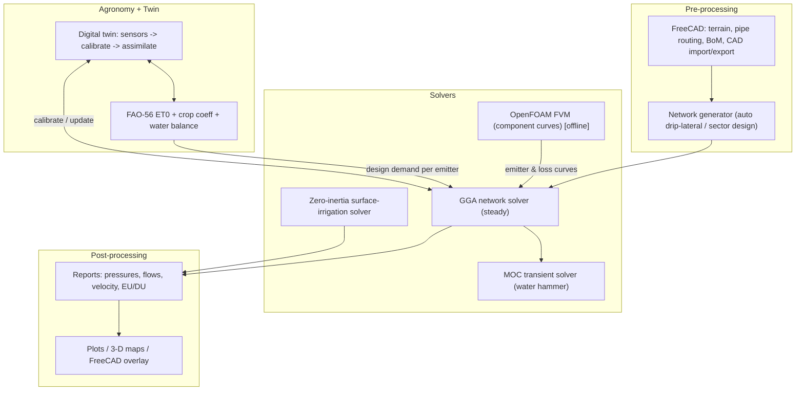

# 10 — Numerical Methods & Architecture for KrishiFlow

Goal: an open, India-built simulation engine equivalent to IRRICAD, IRRIPRO,
WCADI (Rivulis), HydroCalc 3.0 (Netafim) and WinSRFR (USDA) — built on
**FreeCAD** (CAD/pre-processing) and **OpenFOAM** (component CFD), with our own
**hydraulic network solver** at the core, coupled to a **FAO-56 agronomy** layer
and **digital-twin** calibration.

This document picks the methods. The headline conclusion, stated up front so the
rest is in context:

> **Closed-pipe irrigation *network* design is a 1-D problem, not 3-D CFD.**
> The right core solver is the **Global Gradient Algorithm (GGA)** on the mass +
> energy conservation equations — the same method EPANET uses and that IRRICAD /
> IrriPro effectively implement. 3-D FVM (OpenFOAM) is the right tool only for
> *component-scale* detail (emitter labyrinths, pressure-compensating diaphragms,
> manifold junctions), where it generates loss coefficients and emitter curves
> that *feed* the 1-D model. Using 3-D CFD for a whole field would be thousands
> of times more expensive for no design benefit.

## 1. What each reference product actually solves

| Product | Domain | Governing physics | Numerical method |
| --- | --- | --- | --- |
| IRRICAD / IrriPro / WCADI / HydroCalc | Pressurized pipe networks (drip/sprinkler) | Steady mass + energy conservation; head loss; emitter outflow | Nonlinear network solve (GGA / step-by-step / Hardy-Cross legacy) |
| EPANET (the open reference) | Water distribution networks | Same as above + extended-period | **Todini-Pilati Global Gradient Algorithm** (Newton-Raphson, sparse SPD) |
| WinSRFR (USDA) | Surface irrigation (furrow/border/basin) | 1-D Saint-Venant (open-channel) + infiltration | Zero-inertia / kinematic-wave, **Preissmann scheme** + Kostiakov-Lewis |
| (component design) | Emitter / valve internal flow | 3-D Navier-Stokes (turbulent) | **Finite Volume (OpenFOAM)** |

Takeaway: a complete "irrigation CAE" suite needs **three coupled solvers**, not
one. We build them in priority order (network first).

## 2. The governing equations

### 2a. Pressurized network (closed pipe) — steady
Per link `k` (start `s` -> end `e`), energy/head-loss law:

```
H_s - H_e = h_L(Q_k) = r_k * Q_k * |Q_k|^(n-1)   (+ minor losses + pump head)
```

Continuity at every junction `i` (Kirchhoff node law):

```
sum_k (A^T)_{ik} Q_k = d_i        (d_i = demand / emitter outflow)
```

This is a sparse, nonlinear algebraic system — **not** a PDE at network scale.

Head-loss closures:
- **Hazen-Williams**: `n=1.852`, `r = 10.67 L / (C^1.852 d^4.87)` (SI). Empirical,
  water-only, turbulent. Most common in practice; what we default to.
- **Darcy-Weisbach** (more correct, all regimes/fluids): `h_L = f (L/d) V^2/2g`,
  `r = 8 f L / (pi^2 g d^5)`. Friction factor `f` via **Swamee-Jain** (explicit
  Colebrook-White approximation) for `Re>4000`, `f=64/Re` for laminar.

### 2b. Transient / water hammer — unsteady, hyperbolic PDE
For surge/valve-closure analysis, the 1-D water-hammer equations:

```
dH/dt + (a^2/gA) dQ/dx = 0
dQ/dt + gA dH/dx + f Q|Q|/(2 d A) = 0
```

Best solved by the **Method of Characteristics (MOC)** along `dx/dt = ±a`.

### 2c. Surface irrigation — 1-D Saint-Venant (WinSRFR equivalent)
Continuity + momentum for overland flow with infiltration sink:

```
dA/dt + dQ/dx + I(x,t) = 0
dQ/dt + d(Q^2/A)/dx + gA(dh/dx - S0 + Sf) = 0
```

Use the **zero-inertia** simplification (drop acceleration terms; valid for low
Froude numbers, all practical fields) discretized with the **Preissmann
four-point implicit scheme**; infiltration via **Kostiakov-Lewis**.

### 2d. Soil water (digital-twin / agronomy coupling) — Richards' equation
Unsaturated flow in the root zone:

```
d(theta)/dt = d/dz [ K(h) (dh/dz + 1) ] - S(z,t)   (S = root uptake)
```

Solve by **FEM or FVM in 1-D/2-D** (HYDRUS uses Galerkin FEM). For the MVP
agronomy layer we use the simpler, well-accepted **FAO-56 layered water-balance
("bucket") model**; Richards is the later high-fidelity upgrade.

## 3. Method comparison & recommendation (the "which solver" answer)

| Sub-problem | Candidate methods | Recommendation | Why |
| --- | --- | --- | --- |
| Pipe-network steady solve | Hardy-Cross (loop), Newton nodal, **GGA** | **GGA (Todini-Pilati)** | Sparse, symmetric, positive-definite; robust convergence; handles pumps/valves/PDD without re-structuring; the proven EPANET core |
| Head loss | Hazen-Williams, Darcy-Weisbach | **Offer both; default HW, DW for non-water / wide Re** | HW is industry habit; DW + Swamee-Jain is physically correct |
| Emitter outflow | fixed demand, power law `q=kH^x`, PC clamp | **Power-law via virtual link; PC as clamped demand** | Lets the same GGA solve emitters uniformly (see solver design) |
| Transients | MOC, FV, FEM | **MOC** | Standard, accurate for water-hammer; simple to implement on 1-D graph |
| Surface irrigation | full hydrodynamic, **zero-inertia**, kinematic-wave | **Zero-inertia (Preissmann)** | WinSRFR's workhorse; robust across field conditions |
| Component internal flow | analytical, **3-D FVM** | **OpenFOAM FVM** (`simpleFoam`/`pisoFoam`) | Only place 3-D CFD earns its cost: derive emitter curves & loss coeffs |
| Soil water | FAO-56 bucket, **Richards FEM/FVM** | **FAO-56 now, Richards later** | Simplicity-first; upgrade when data justifies |

Why **not** FEM/FVM for the whole network: FEM/FVM discretize a *continuous
domain* into millions of cells. A pipe network is a *graph* of ~10^2-10^5 edges;
the GGA solves it directly in seconds. 3-D CFD of a field would be 10^3-10^6x
more expensive and add no design-relevant accuracy — pipe head loss is already
captured by validated 1-D closures. This is the key engineering judgement that
separates a usable product from an academic toy.

## 3.5 Component library — and how each is modeled numerically

The crucial insight that keeps the engine simple: **every component is just a
"link" with its own head-vs-flow relationship `h(Q)` and gradient `dh/dQ`, or a
node-level term.** The GGA does not care whether a link is a pipe, a pump, or a
valve — it only needs `h(Q)` and `g = dh/dQ` each iteration. So adding hardware
is adding small closure functions, not new solvers.

### Links that *lose* head (h_L > 0)

| Component | Model | h(Q) | Notes |
| --- | --- | --- | --- |
| Pipe / lateral / mainline | friction + minor | `r Q\|Q\|^(n-1) + m Q\|Q\|` | HW or DW; `m = ΣK/(2 g A^2)` |
| **Elbow / L-connector (bend)** | minor loss | `m Q\|Q\|` | K≈0.3 (45°) .. 0.9 (90° threaded), 0.2-0.3 (long-radius) |
| **Tee / T-connector** | minor loss | `m Q\|Q\|` | K≈0.6 (run/flow-through), 1.0-1.8 (branch) |
| Reducer / expansion, coupler, bend | minor loss | `m Q\|Q\|` | K from fitting tables |
| **Ball valve (open)** | minor loss | `m Q\|Q\|` | K≈0.05 full-open; rises steeply as it closes |
| **Gate valve** | minor loss | `m Q\|Q\|` | K≈0.15 full-open |
| **Disc / screen / media filter** | minor loss (+clogging) | `m Q\|Q\|` | K large (10-40+); clean vs clogged ΔH band; main pressure sink in drip |
| **Venturi injector (fertigation)** | loss curve | `a Q\|Q\|` (manufacturer) | Large deliberate ΔH to create suction; also a nutrient *source* node |
| Check valve, air/flush valve | minor loss + status | `m Q\|Q\|` | mostly status logic |

### Links that *gain* head (pumps)

| Component | Model | h(Q) | Notes |
| --- | --- | --- | --- |
| **Pump / motor set (1-50 HP)** | head-gain curve | `h_gain = h0 - r_p Q^c` | 3-point curve fit (shutoff, design, max); GGA uses `g = -c r_p Q^(c-1)`; energy: `H_e - H_s = -h_gain` |

Pump <-> motor sizing (the "1-50 HP" requirement):
```
Hydraulic power  P_hyd [kW] = rho * g * Q * H / 1000      (rho=1000, g=9.81)
Shaft power      P_shaft     = P_hyd / eta_pump
Motor rating     P_motor     = P_shaft / eta_motor * safety   (-> pick 1..50 HP)
1 HP = 0.7457 kW
```
So the pump *curve* drives the hydraulics (head & flow), and the resulting `Q,H`
back-computes the **required motor HP**, which we snap to the nearest catalog
size in 1-50 HP. The post-processor reports duty point, efficiency and HP.

### Control valves (set a target, not a fixed loss)

| Component | Type | Behaviour |
| --- | --- | --- |
| **Pressure Reducing Valve (PRV)** | downstream-pressure control | holds downstream head at setpoint when upstream is higher (key drip accessory) |
| Pressure Sustaining Valve (PSV) | upstream-pressure control | holds upstream head at setpoint |
| Flow Control Valve (FCV) | flow limit | caps flow at setpoint |
| Throttle Control Valve (TCV) | fixed K | a ball/gate valve at a set opening |

Control valves are handled in the GGA by **status switching**: each iteration the
valve is ACTIVE (enforces its setpoint as a boundary), fully OPEN (acts as a
minor loss), or CLOSED (link removed), and the mode is re-checked until stable —
exactly EPANET's approach. (MVP implements TCV/minor-loss + open/closed status;
PRV/PSV/FCV are the next increment, flagged in the code.)

### Emitters / drippers (node outlets)
Pressure-dependent withdrawals, not links: `q = k P^x` (non-PC) or clamped
`nominal_q` over `[p_min, p_max]` (PC). See `emitters.py`.

### Fertigation chemistry (venturi / dosing pump)
The venturi is hydraulically a loss element **and** a nutrient injection node.
Concentration transport along the network (advection + first-order decay) is a
*water-quality* solve layered on top of the hydraulic solution — same pattern as
EPANET's WQ module. This couples directly to the FAO-56 / soil-nutrient twin.

### Revised recommendation, with components

- Keep the **single GGA core**; implement each component as a `Link` subtype
  exposing `headloss(Q)` and `gradient(Q)`. This is why pumps, valves, tees and
  venturis do **not** each need a bespoke solver.
- Maintain a **fittings/accessories K-library** (elbows, tees, valves, filters,
  couplers) and a **pump-curve catalog** (by HP band). Selecting a part = looking
  up `K` or a curve; the physics is unchanged.
- Run **OpenFOAM (FVM) offline** only to *generate* `K`/loss-curve values for
  parts that lack reliable catalog data (custom venturis, labyrinth emitters,
  manifold tees) — then cache them in the library. This is the only place 3-D CFD
  enters, and it enters as data, not as a per-design solve.

## 4. Multi-scale architecture (how the pieces connect)



## 5. Technology stack

- **Core solver**: Python + NumPy/SciPy (sparse) for the MVP — fast to build,
  validate, and integrate with FreeCAD's Python API and PyFoam. Hot loops move to
  C++/Rust later if profiling demands. (This MVP: pure NumPy, SciPy optional.)
- **Pre/post UI**: FreeCAD workbench (Python) for geometry; web viewer reuses the
  existing KrishiTwin front-end style for dashboards.
- **Component CFD**: OpenFOAM, scripted via PyFoam; results cached as emitter
  curves / minor-loss coefficients (run offline, not per design).
- **Data formats**: EPANET `.inp` import/export for interoperability; JSON native.

## 6. Build order (what this repo delivers now)

1. **GGA network solver** (steady, HW + DW) handling pipes, **pumps, valves and
   minor losses** as generic links — `krishiflow/solver.py`.
2. **Component library**: fittings/accessories K-table (tees, elbows, valves,
   filters), pump-curve + motor-HP sizing, venturi loss element —
   `components.py`.
3. **Emitter models** (power-law via virtual links + PC) — `emitters.py`.
4. **Pre-processor** (JSON + drip-lateral generator) — `preprocess.py`.
5. **Post-processor** (report + EU/DU + pump duty/HP + plots) — `postprocess.py`.
6. **FAO-56 module** (ET0 PM + dual Kc + water balance) — `fao56.py`.
7. **Validation tests** — `tests/`.

Later phases: MOC transients, zero-inertia surface solver, OpenFOAM coupling,
Richards soil model, FreeCAD workbench, EPANET `.inp` I/O. See doc 11 for the
FreeCAD/OpenFOAM/digital-twin/IIT-Palakkad roadmap.

### Deep-dive & design documents (read next)

The architecture is now organized as **two products on one shared, live-parametrized,
QC-guarded engine** — see [19-two-product-architecture.md](19-two-product-architecture.md).
Detailed design/research docs:

| Doc | Topic |
| --- | --- |
| [12 — Solver mathematics](12-solver-mathematics.md) | A0 live parametrization + GGA/MOC/Saint-Venant/Richards/FAO-56/CFD derivations |
| [13 — Sensors & instrumentation](13-sensors-and-instrumentation.md) | device taxonomy, AWS, placement, **B6 data-quality guards** |
| [14 — Digital twin & data assimilation](14-digital-twin-data-assimilation.md) | EKF/EnKF, gating, parameter write-back |
| [15 — IIT Palakkad & KAU brief](15-iitpkd-collaboration-brief.md) | faculty/module mapping, engagement plan |
| [16 — Annotated bibliography](16-annotated-bibliography.md) | grouped references |
| [17 — Weather data integration](17-weather-data-integration.md) | NASA POWER / Open-Meteo / IMD / GEFS, precedence |
| [18 — IoT control architecture](18-iot-control-architecture.md) | edge/cloud, LoRa, fertigation, plug-and-play protocol, solar |
| [19 — Two-product architecture](19-two-product-architecture.md) | Design Studio + Runtime, shared core, learning loop |
| [20 — Design optimization](20-design-optimization.md) | NSGA-II, objectives, top 2-3 setups |
| [21 — Agronomy layer](21-agronomy-layer.md) | crops, fertilization, yield + recording loop |

## 7. References (grounding)
- Todini & Pilati (1988), *A gradient algorithm for the analysis of pipe
  networks*; Todini & Rossman (2013). EPANET 2.2 Analysis Algorithms.
- Rossman, EPANET 2 Users Manual (head-loss formulas, Swamee-Jain `f`).
- Bautista, Clemmens, Strelkoff et al. — WinSRFR / SRFR (zero-inertia,
  Preissmann, Kostiakov-Lewis).
- Allen et al. (1998), *FAO Irrigation & Drainage Paper 56*; ASCE-EWRI (2005)
  standardized reference ET (the "updated FAO-56").
