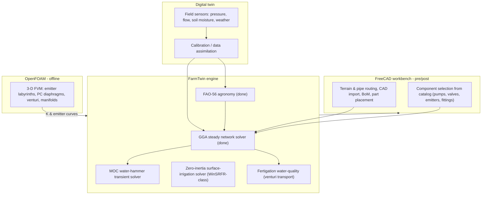

# 11 — FreeCAD / OpenFOAM / Digital-Twin / IIT Palakkad Roadmap

How the MVP engine grows into a full IRRICAD/IrriPro/WinSRFR-class product, and
how to leverage the research ecosystem on your doorstep.

> **Now structured as two products.** This roadmap is realized as **Product 1
> (Design Studio)** and **Product 2 (Runtime)** on one shared engine — see
> [19-two-product-architecture.md](19-two-product-architecture.md). The detailed
> deep-dive docs are 12-21 (the FreeCAD pre/post and OpenFOAM offline CFD below feed
> Product 1; the digital twin and IIT/KAU collaboration feed both). Specifically:
> solver math [12](12-solver-mathematics.md); sensors + QA/QC
> [13](13-sensors-and-instrumentation.md); digital twin
> [14](14-digital-twin-data-assimilation.md); IIT PKD/KAU
> [15](15-iitpkd-collaboration-brief.md); weather
> [17](17-weather-data-integration.md); IoT control + fertigation + solar
> [18](18-iot-control-architecture.md); design optimizer
> [20](20-design-optimization.md); agronomy + yield [21](21-agronomy-layer.md).

## 1. The full target architecture

## 2. FreeCAD integration (pre- and post-processor)

FreeCAD is the open CAD platform; we ship a **FarmTwin workbench** (Python):

1. **Geometry & terrain**: import survey/Google-terrain, draw mains/submains/
   laterals as sketches/wires; elevations from a DEM. (Your 15-acre plot becomes
   a real model.)
2. **Component placement**: drop pumps, valves, filters, venturis, emitters from
   the catalog onto the layout; each carries its hydraulic parameters.
3. **Export to solver**: a workbench command serializes the model to the
   FarmTwin JSON schema (`preprocess.network_from_dict`) and runs `solve()`.
4. **Post-processing overlay**: color pipes by velocity, nodes by pressure, show
   emitter uniformity and the **bill of materials** — IRRICAD's headline outputs.
5. **Why FreeCAD**: free, scriptable (same Python as the engine), CAD import/
   export for interoperability; avoids per-seat licence costs that make IRRICAD/
   IrriPro expensive for Indian FPOs.

Build order: JSON round-trip (now) -> read-only viewer -> interactive workbench.

## 3. OpenFOAM integration (component CFD, offline)

OpenFOAM (finite-volume CFD) is used **only** to characterize components that
lack reliable catalog data, then results are cached as curves the 1-D solver
reads:

| Use case | OpenFOAM setup | Output cached into FarmTwin |
| --- | --- | --- |
| Dripper labyrinth flow | `simpleFoam`/`pimpleFoam`, small mesh | emitter `k`, exponent `x`, anti-clog insight |
| Pressure-compensating diaphragm | FSI / parametric `p` sweep | `nominal_q`, operating band `[p_min, p_max]` |
| Venturi injector | incompressible turbulent, suction port | loss-curve `a`, suction vs motive-flow |
| Tee / manifold junction | steady turbulent | branch/run `K` values for the K-library |
| Filter element | porous-media model | clean & clogged `K` band |

Scripted via **PyFoam**; runs on a workstation or the IIT Palakkad HPC cluster
(see below). This is the only place 3-D CFD enters — as *data*, not a per-design
solve. (Reinforces the doc-10 argument against meshing the whole field.)

## 4. The three solver tracks (engineering scope)

1. **Pressurized networks (done)** — GGA steady. Next: PRV/PSV/FCV control
   valves, extended-period (tank/scheduling) simulation, EPANET `.inp` I/O.
2. **Transients / water hammer** — Method of Characteristics on the 1-D
   water-hammer PDEs; critical for valve-closure/pump-trip protection sizing.
3. **Surface irrigation (WinSRFR-class)** — 1-D Saint-Venant, zero-inertia,
   Preissmann scheme + Kostiakov-Lewis infiltration; for furrow/border/basin
   fields (relevant to paddy and open-field crops in Palakkad).

## 5. Digital-twin layer (the FarmTwin coupling)

The engine becomes a *twin* when it runs continuously against field data:

- **Inputs**: pressure/flow sensors at the head and zone valves; soil-moisture
  probes; a weather feed (IMD Palakkad / on-farm station) driving FAO-56.
- **Calibration**: adjust pipe roughness, emitter clogging, and soil parameters
  so simulated pressures/flows/moisture track sensors (least-squares / Kalman).
- **Assimilation & control**: the twin recomputes the FAO-56 requirement daily,
  converts it to emitter design flow and **valve schedules**, and flags
  anomalies (a pressure drop = a clog or leak located on the network graph).
- **Fertigation**: venturi injection + water-quality transport closes the
  nutrient loop with the soil model.

This is exactly the FarmTwin product thesis (see `../../docs/01-venture-decision.md`),
now backed by a real solver instead of a heuristic.

## 6. Leverage IIT Palakkad (research + incubation)

IIT Palakkad is ~50-70 km away and is unusually well-matched:

- **Dr. B. Sridharan** (Civil/Water Resources): computational & experimental
  hydraulics, open-channel flow, **water supply systems**, CFD, dam-break — a
  direct fit for solver validation, the surface-irrigation track, and OpenFOAM
  component studies. Approach for joint validation + a flume/pipe-rig test.
- **Dr. Athira P., Dr. Subhasis Mitra, Dr. Sarmistha Singh**: hydrology,
  agricultural water security, watershed modeling — fit for the FAO-56 / soil
  twin calibration and field trials.
- **Water Resources Engineering Lab + HPC cluster**: experimental flumes and
  pipe-flow rigs to validate head-loss/emitter models; HPC for OpenFOAM runs.
- **TECHIN** — IIT Palakkad's Technology Business Incubator, **recognized by
  Startup India**: incubation, mentorship, and grant access. This complements
  the KSUM/AgriNext path (docs 03-07): a deeptech engine like FarmTwin is
  exactly TECHIN's profile.

### Concrete engagement plan
1. Share the MVP + a validation note; request a meeting with Dr. Sridharan's
   group on joint solver/flume validation.
2. Propose a student project (M.Tech Water Resources) to validate FarmTwin
   against EPANET + lab data and to build the OpenFOAM emitter-curve library.
3. Apply to **TECHIN** incubation in parallel with KSUM Idea Grant; cite the IIT
   collaboration in the AgriNext submission (doc 05) for credibility.
4. Co-author a paper (validation of an open Indian irrigation solver) — strong
   IP/credibility signal for Productisation/Seed funding.

## 7. Milestones

| Phase | Deliverable | Partner |
| --- | --- | --- |
| Now | GGA solver + components + FAO-56 (this repo) | - |
| +1-2 mo | EPANET `.inp` I/O + validation vs EPANET; flume check | IIT Palakkad |
| +2-4 mo | FreeCAD viewer + BoM; OpenFOAM emitter-curve pilot | IIT HPC |
| +3-6 mo | MOC transients; PRV/FCV; on-farm twin pilot (15 acres) | KSUM/AgriNext |
| +6-12 mo | Surface-irrigation solver; FreeCAD workbench v1 | TECHIN incubation |
