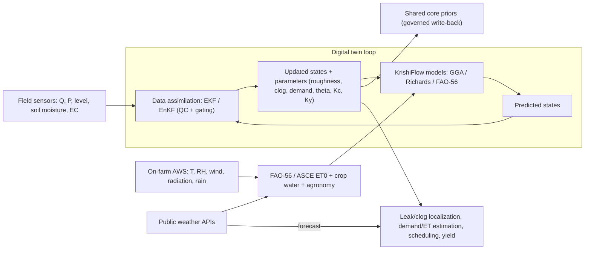

# 14 — Digital Twin & Data Assimilation

The digital twin is the heart of Product 2 ([19-...](19-two-product-architecture.md)):
a running model that is **continuously corrected** by field data, estimates hidden
parameters, and feeds those corrections back to the shared core so both products improve.



## C1. State-space and assimilation

Formulate a discrete state-space model from the hydraulic + soil + agronomy equations:

```
x_{k+1} = f(x_k, u_k, theta) + w_k        (process model: GGA / Richards / FAO-56)
z_k     = h(x_k, theta)      + v_k        (measurement model: sensors at their locations)
w_k ~ N(0, Q),  v_k ~ N(0, R)
```

State `x` includes nodal heads/pressures, soil moisture per zone, and agronomy state
(crop stage, stress, yield). **Parameters** `theta` (pipe roughness, emitter/filter
clogging, nodal demand, Kc, soil van Genuchten, Ky) are treated as **augmented states**
so the filter estimates them too. Use **pressure-dependent demand (PDD)**.

### EKF vs EnKF

| | EKF (Extended Kalman Filter) | EnKF (Ensemble Kalman Filter) |
| --- | --- | --- |
| Idea | Linearize f,h via Jacobians | Monte-Carlo ensemble, sample covariance |
| Cost | Lean (one solve + Jacobian) | Heavier (N ensemble solves), parallel |
| Strength | Fast, good near-linear | Robust to strong nonlinearity, no Jacobian |
| Recommended | Lean default for a single site | When nonlinearity/dimension grows (multi-site, Richards) |

A **staged scheme** (assimilate pressure, then flow, then demand) is reported to beat
simply buying more precise sensors.

### Robustness (ties to B6)

All measurements first pass the B6 QC gate
([13-...](13-sensors-and-instrumentation.md)). The filter then adds:

- **Innovation (chi-square) gating:** reject any measurement whose normalized residual
  `(z - h(x))^T S^-1 (z - h(x))` exceeds a threshold.
- **Robust (Huber) update** + **covariance inflation:** limit the damage of any outlier
  that slips through.

So no single bad reading can corrupt states or the parameter write-back.

**Refs:** EKF online state estimation in WDS (state-space from 1-D Saint-Venant), NSF
PAR 10537042; Corr-EKF process-noise covariance, NSF PAR 10653477; 3-EnKF-WDN multi-step
assimilation with PDD, *Water Resour. Manage.* (2024) doi:10.1007/s11269-024-03809-9;
end-to-end DT with wireless pressure sensing (Unalakleet), *ACS ES&T Water*
doi:10.1021/acsestwater.5c01515; Evensen (2003) EnKF; Bar-Shalom et al. (2001) gating.

## C2. Real-time weather + AWS ingestion

The AWS ([13-...](13-sensors-and-instrumentation.md) §B4) and public feeds
([17-...](17-weather-data-integration.md)) drive the agronomy side each cycle: pull AWS
(gap-filled), recompute FAO-56 ET0 and the dual-Kc requirement, advance crop stage by
GDD ([21-...](21-agronomy-layer.md)), and update each zone's target soil moisture and
emitter design flow. Forecasts drive look-ahead scheduling (skip irrigation before rain).
Soil-moisture sensors are assimilated to correct the FAO-56/Richards state.

## C3. Parameter estimation & governed write-back (closing the loop)

Confident parameter estimates are promoted to the shared core as new **priors** — this
is the upstream feedback of [19-...](19-two-product-architecture.md) §4b:

```
estimate theta_hat with uncertainty sigma_hat (from filter covariance)
promote IF: enough samples AND sigma_hat << prior sigma AND QC-clean window
            AND change within a bounded step (sanity)
write to params.py with { value, uncertainty, source=field, version, updated_at }
```

This is **governed** — versioned and reviewable, not a silent mutation. Recorded yield
([21-...](21-agronomy-layer.md) §F4) calibrates the slow agronomy parameters (Ky, Kc,
nutrient response) on a seasonal cadence.

## C4. Twin use-cases wired to the venture

| Use-case | Mechanism |
| --- | --- |
| Leak / burst localization | pressure residual pattern on the network graph |
| Emitter / filter clog detection | rising minor-loss / falling emitter flow at fixed pressure |
| Real-time demand / ET estimation | augmented-state estimate + FAO-56 |
| Automatic model calibration | parameter write-back (C3) |
| Forecast-driven scheduling | ET forecast -> FAO-56 requirement -> per-zone schedule |
| Yield tracking | agronomy state in the twin + recorded yield |

The soil twin (Richards/FAO-56), hydraulic twin, and agronomy state co-evolve — the twin
tracks not just water but the crop and its forecast yield. This is the engine behind the
KrishiTwin product thesis ([docs/01-venture-decision.md](../../docs/01-venture-decision.md)).

## C5. Module

A planned `twin/assimilation.py` (EKF/EnKF) reading the network from
[`network.py`](../krishiflow/network.py) and the models from
[`solver.py`](../krishiflow/solver.py) / [`fao56.py`](../krishiflow/fao56.py), guarded by
`quality/qc.py`, writing to `params.py`.
