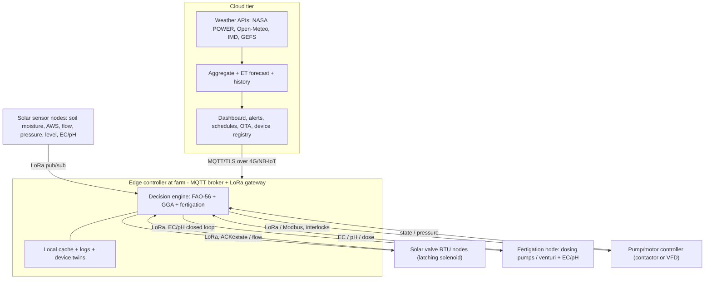

# 18 — IoT Control Architecture (irrigation + fertigation, wireless, solar)

Product 2's actuation layer: a 3-tier IoT system that gets data from the pump, field
sensors, and cloud, and regulates **irrigation and fertigation** by controlling the
pump, valves, and nutrient dosing — wirelessly and solar-powered.

> **Design principle: edge-first.** The decision engine runs locally so irrigation /
> fertigation keep working through rural connectivity gaps. The cloud is the
> authoritative store, forecaster, and dashboard — not in the real-time control loop.



## E1. Cloud tier

Ingests public weather ([17-...](17-weather-data-integration.md)), stores history, runs
the ET forecast, hosts the dashboard/alerts + device registry, and pushes
schedules/setpoints and OTA firmware to the edge over MQTT (4G/NB-IoT). Multi-site
authoritative store; deliberately outside the real-time loop.

## E2. Edge decision engine (when + how long)

Runs on a farm gateway (Raspberry Pi-class SBC or industrial RTU). It fuses cloud
forecast + setpoints with live field sensors and runs FAO-56 + GGA locally; works
offline from cached weather and reconciles when the cloud returns.

**Decision logic:**

```
TRIGGER irrigation ON when:
    Dr >= MAD * TAW          (root-zone depletion from soil-moisture + FAO-56)
    AND forecast rain < threshold within horizon
    AND inside the allowed irrigation window
    AND source available (sump level / inlet pressure OK)

DURATION:
    t = net depth d_net * zone_area / (system flow Q from GGA) / efficiency
    OR close-loop on soil-moisture sensor up to field capacity
    cap to avoid deep percolation

SEQUENCING:
    limited by pump capacity (max simultaneous zones from the solver)
    pump <-> valve interlock ordering
```

**Data guard:** all inputs pass the B6 QC gate
([13-...](13-sensors-and-instrumentation.md)); on missing/failed critical inputs the
engine **fails safe** (hold or conservative schedule), never actuating on bad data.

**Module:** reuses [`fao56.py`](../FarmTwin/fao56.py) + [`solver.py`](../FarmTwin/solver.py)
in a planned `edge/` runtime.

## E3. Wireless link (~500 m)

**Recommend LoRa on the sub-GHz 865-867 MHz India ISM band** (license-free per TEC/WPC),
point-to-point/star or a small private LoRaWAN (IN865).

| Option | Range | Power | Verdict |
| --- | --- | --- | --- |
| **LoRa / LoRaWAN IN865** | km-scale | very low | **chosen** — 500 m trivial, solar-friendly, penetrates canopy |
| Zigbee / 2.4 GHz | ~100 m | low | needs mesh; canopy attenuation |
| Wi-Fi HaLow 802.11ah | ~1 km | medium | pricier / less locally mature |
| nRF24L01+PA/LNA | ~1 km LOS | low | weak regulatory/ACK stack |
| BLE | <100 m | very low | too short |
| Cellular 4G/NB-IoT | wide | higher | backhaul only, not field actuation |

**Reliability:** acknowledged commands with retries, per-node addressing, fail-safe
defaults (valves close / hold last-safe state on link loss), hardware watchdog.

## E4. Controller hardware (valve, motor, cloud signals)

- **Edge controller / gateway (ICU):** SBC or MCU + LoRa concentrator + cellular
  backhaul; runs E2; MQTT to cloud; local logging.
- **Valve RTU node:** ESP32/STM32 + LoRa, H-bridge driver for **DC latching solenoid
  valves** (latching = near-zero idle power), optional local flow/pressure sensing,
  solar + Li-ion, IP65.
- **Pump/motor controller:** contactor/DOL starter or Modbus-RTU VFD for 1-50 HP motors
  (ties to motor sizing in [`components.py`](../FarmTwin/components.py)). **Safety
  interlocks:** dry-run protection (sump level/inlet pressure), thermal overload,
  phase-failure, and pump<->valve sequencing (open a zone valve before pump start; stop
  the pump before closing the last valve) to prevent deadheading and water hammer
  (links to MOC, [12-...](12-solver-mathematics.md) §A2).
- Every field command + state is logged back to the twin
  ([14-...](14-digital-twin-data-assimilation.md)) for as-run vs planned.

## E5. Fertigation control (closed-loop nutrient dosing)

A peer IoT node co-located with irrigation control.

- **Hardware:** injection by venturi (modeled in
  [`components.py`](../FarmTwin/components.py)) or a dosing pump
  (peristaltic/diaphragm), multi-channel for N-P-K + acid; inline EC + pH probes
  downstream of the mixing point; mainline flow meter.
- **Control:** target EC/pH and N-P-K split per crop stage come from the agronomy
  nutrient plan ([21-...](21-agronomy-layer.md) §F3); a **PID + feed-forward** law
  adjusts injector rate from measured EC/pH and flow (**proportional dosing** = dose
  tracks flow).
- **Safety interlocks:** inject only when irrigation flow is present (no-flow lockout),
  EC-high and pH-window cutoffs, end-of-cycle clean-water **flush**, stock-tank-empty
  detection, backflow prevention.
- Dosing coefficients are live params (A0); EC/pH pass the B6 QC gate; events log to the
  twin.

## E6. Device interoperability protocol (wireless plug-and-play)

Goal: add any sensor/controller/actuator and have it share data **wirelessly, with no
manual wiring or config**.

- **Transport:** LoRa/LoRaWAN IN865 in the field (E3); gateway bridges to cloud over
  MQTT/TLS.
- **Messaging:** publish/subscribe — MQTT (gateway/cloud) + MQTT-SN (or LoRaWAN
  application payloads) on constrained nodes; payloads in **CBOR/Protobuf** (compact,
  battery-friendly) with a JSON mirror for debugging; topics `site/zone/device/metric`.
- **Plug-and-play onboarding:** secure **LoRaWAN OTAA** join (DevEUI + AppKey ->
  AES-128 session keys); on join, a node publishes a **self-description / capability
  descriptor** (its sensors/actuators, units, ranges, sample rate) and the registry
  auto-creates its **device twin/shadow** (desired vs reported). Patterned on **Eclipse
  Sparkplug B** birth/death certificates and **W3C Web of Things** Thing Description /
  MQTT auto-discovery.
- **Semantic interop:** a small unit/metric ontology so a new soil-moisture brand maps
  onto the same `theta` variable — no per-device code. The declared ranges feed the B6
  range checks.
- **Reliability & security:** per-device keys + message auth, ACK + store-and-forward at
  the gateway during cloud outages, time sync, OTA over the same channel.

## E7. Wireless power — solar energy autonomy

- **Node power:** small PV panel + LiFePO4/Li-ion + charge controller (MPPT for larger
  nodes), ultra-low-power MCU with deep-sleep duty-cycling; **DC latching solenoids**
  (zero holding power).
- **Energy budget:** size PV + battery for N-days monsoon autonomy from the duty cycle
  (sample interval x radio TX energy); LoRa's tiny TX duty enables multi-year runtime.
- **Gateway / pump controller:** larger PV + battery, or mains where it sits — the pump
  needs 3-phase mains anyway, so the gateway/pump-controller can share that supply; only
  the distributed sensor/valve/fertigation nodes must be solar.
- **Robustness:** brown-out-safe state, supercap clean shutdown, watchdog, low-battery
  telemetry surfaced as a B6 health signal (predictive maintenance).

## E8. Module map

| Concern | Module |
| --- | --- |
| Edge decision runtime | `edge/` (reuses fao56.py + solver.py) |
| LoRa protocol + node firmware (valve/pump/fertigation) | `control/` |
| Cloud services + registry + dashboard | `cloud/` |
| Device twins / shadows | `cloud/` + `twin/` |

## E9. References

- LoRaWAN 1.0.4 regional parameters IN865 (LoRa Alliance); India 865-867 MHz license-free
  (TEC/WPC).
- OASIS MQTT 3.1.1 / v5; MQTT-SN; Eclipse Sparkplug B; W3C Web of Things (Thing
  Description); CoAP (RFC 7252); Matter/Thread (future IP nodes).
- LoRa-based smart-irrigation control + solar/energy-harvesting WSN field studies (MDPI
  *Sensors* / *Agronomy*).
- FAO-56 MAD / readily-available-water thresholds (Allen et al. 1998).
